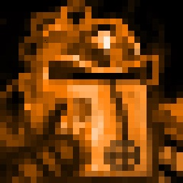
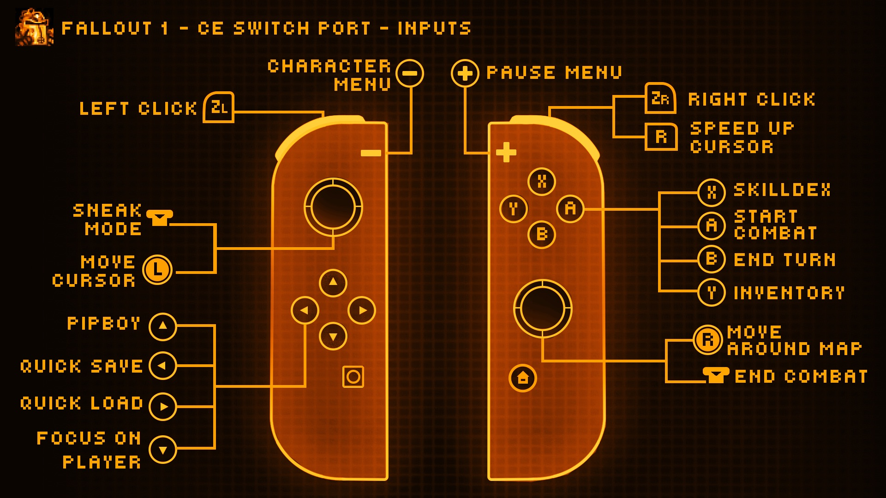

<div align="center">



# Fallout Community Edition - Switch

</div>

You must own the game to play and have a Switch capable of running **unsigned code, so you need a Switch running on custom firmware** to run the port. Needless to say, this is not an official effort from Interplay or Bethesda.

---

## Installation

1. Purchase your copy on [GOG](https://www.gog.com/en/game/fallout) or [Steam](https://store.steampowered.com/app/38400/). The files need to be from a Windows installation (I think.)
2. Download the latest [release](https://github.com/ryandeering/fallout-ce-switch/releases/latest) or build from the source. See YAML pipelines for reference.
3. Drag the installation files into a new folder called `fallout1` in your `switch` folder on the root of your SD card.
4. Create a file named fallout1_nx.ini in your 'fallout2' folder
5. In the fallout1_nx.ini file, paste the following content:
```ini
[MAIN]
SCR_WIDTH=1708
SCR_HEIGHT=960
SCALE_2X=1
; Change resolution and determine scaling. SCALE_2X=1 will turn 2x scaling on. SCALE_2X=0 will turn it off. 
```
*WARNING* Failure to create the fallout1_nx.ini and required content in it will cause the game to immediately crash upon launch!

6. Put the necessary executable in your `switch` folder on the root of your SD card, either `.nro` or `.nso`.

> **Note:** I would not expect your original Fallout 1 saves/non-CE saves to work. And keep multiple saves! Quick save/quick loading currently save/load twice. This will be fixed... eventually.

## Controls

<div align="center">



</div>

- **Basic touchscreen support is implemented.**
- **On-screen keyboard support implemented for names and saves.**

## Configuration

- **Cursor Sensitivity**: Adjustable in options via mouse sensitivity. Note this will affect cursor speedup as well.
- **Resolution**: You can configure resolution and scaling through a config file. Create a file in your `fallout1` folder called `fallout1_nx.ini` - It needs to follow the following structure:

## Issues

If you encounter any issues, please create an issue, and I'll look into it when I have time. Other contributors are welcome to assist in solving and fixing issues if interested.

## Questions

- **Fallout 2 wen?**

> [It's done!](https://github.com/ryandeering/fallout2-ce-switch)

## Credits

- **Interplay**: For developing and publishing the original game.
- **alexbatalov and fallout-ce Contributors**: For their excellent work in keeping this game modern.
- **Romane**: For the graphics.

Much appreciated to all.
